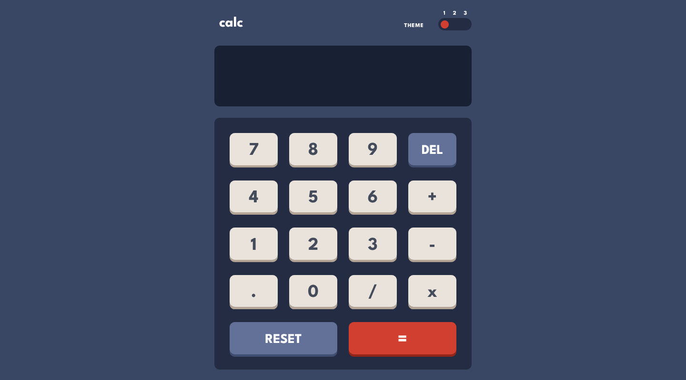

# Calculator App

## Challenge

Users of this app should be able to:

- See the size of the elements adjust based on their device's screen size
- Perform mathmatical operations like addition, subtraction, multiplication, and division
- Adjust the color theme based on their preference
- **Bonus**: Have their initial theme preference checked using `prefers-color-scheme` and have any additional changes saved in the browser

### Links

- [Solution](https://www.frontendmentor.io/solutions/calculator-app-using-react-eNoJBXESIk)
- [Live Site](https://dashing-speculoos-328c59.netlify.app/)

### Built with

- React JS
- Flexbox
- CSS Grid
- CSS custom properties
- Desktop-first workflow

## Author

- Frontend Mentor [@Isaiah-B](https://www.frontendmentor.io/profile/Isaiah-B)
